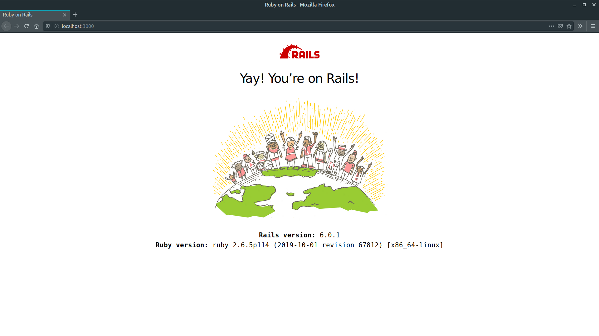

# To-Do List
A simple To-Do List app written in Rails and React as submission for CVWO AY19/20 Assignment.

**Name:** Sebastian Toh Shi Jian  
**Matriculation Number:** A0196545R

## Mid-Assignment Submission
Successful Installation of Rails:


[Mid-Assignment Write-Up](cvwo-submissions/mid-assignment-Sebastian_Toh-A0196545R.pdf)

## Final Assignment Submission (WIP)

[Final Assignment Write-Up](cvwo-submissions/final-assignment-Sebastian_Toh-A0196545R.pdf)

Proof of working application: [Demo](https://limitless-plains-01239.herokuapp.com/)

## Running Locally
Clone this repository:
```bash
git clone https://github.com/sebastiantoh/todo-app.git
```

Install all dependencies:
```bash
bundle && yarn
```

Create database and run migration:
```bash
rails db:create db:migrate
```

Seed the database (optional):
```bash
rails db:seed
```

Start the local server:
```bash
rails server
```

Open http://localhost:3000/ in your browser.
